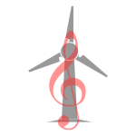

# bemol

Blade Element Momentum (BEM) academic library.



**bemol**: (B)lade (E)lement (M)omentum (O)pen-source (L)ibrary.

From musical notation, bémol means a note a semitone lower. This package is
a semitone lower to commercial or fully packed BEM frameworks, a playground
for students and academics.

## Scope

The aim is to have a very modular basic BEM solver for testing different
models and different aspects of the method. There is no intention to provide
a complete or fast implementation.

### Limitations

- Model is always rigid.
- Blade and rotor forces and moments (thus power) are not calculated, only
  sectional forces and induction factors are obtained.
- Complex geometries (pre-bend or pre-swept) are not considered.
- Non-uniform inflow not taken into account.
- Not exhaustively validated.

## How to use it

To use bemol a `solver` instance must be defined. The solver takes a `rotor`,
the flow density and a list of the secondary corrections as inputs.

Rotors are defined by the blade and rotor characteristics (radial evolution of
sections, chords and twist, airfoil polars, number of blades, etc..).
The Mexico and IEA15MW turbines are already defined. More details on how to implement
your own models are available in [bemol/rotors](bemol/rotors/README.md).

The solution can be called for a given azimuth and flow condition (inflow
velocity and rotor rotation velocity), for a complete cycle, etc. A basic
script would be:

```python
import bemol
rho = 1.2
corrections = []
rotor = bemol.rotor.mexico
solver = bemol.ning.NingUncoupled(rotor,rho,corrections)

pitch = 0.0
omega = 45.0
wind = 15.0
forces, factors = solver.steady(0.0,pitch,wind,omega)
```

Outputs forces and factors represent the normal and tangent forces and axial
and tangential induction factors.

Note that no secondary model is applied if no corrections are defined, such as
in the example code, including the hub/tip correction.

You may find examples in the `samples` folder.

### Implemented models

#### Ning

Implementation of the coupled and uncoupled BEM models of Ning et al.:

Andrew Ning, Gregory Hayman, Rick Damiani and Jason M. Jonkman.
"Development and Validation of a New Blade Element Momentum Skewed-Wake Model
within AeroDyn," AIAA 2015-0215. 33rd Wind Energy Symposium. January 2015. doi:
[doi.org/10.2514/6.2015-0215](10.2514/6.2015-0215), available at
[https://www.nrel.gov/docs/fy15osti/63217.pdf](https://www.nrel.gov/docs/fy15osti/63217.pdf).


### Dependencies

The library is based on [Numpy](https://numpy.org/), [Scipy](https://scipy.org/),
[pandas](https://pandas.pydata.org/) and [PyYAML](https://pyyaml.org/).
[matplotlib](https://matplotlib.org/) is only used in examples, but highly recommended.
[pytest](https://pytest.org/) is as well optional, used for the evaluation
of the tests inside the `tests` sub-folder.

The list of considered/tested versions are available in environment.yaml.
For use with conda:

```bash
conda env create -f environment.yaml
```

Use `conda activate bemol` to use the env.

## Authors

Wagner Gonçalves Pinto, Frédéric Blondel, Caroline Le Guern
@ [IFP Energies nouvelles](https://www.ifpenergiesnouvelles.fr/)